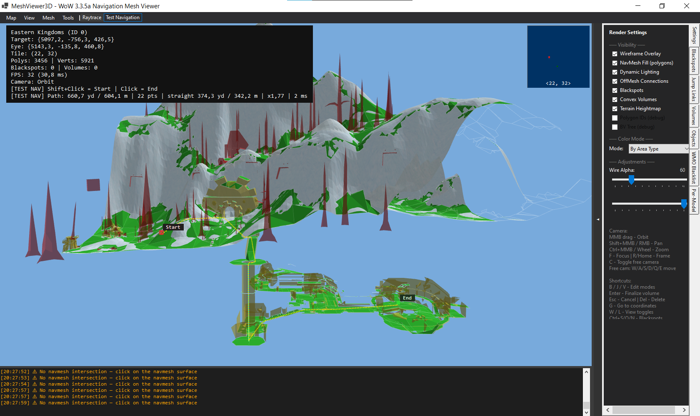

# MeshViewer3D

A 3D navigation mesh viewer and editor for WoW 3.3.5a (build 12340), built to replicate and extend the workflow of Honorbuddy's Tripper.Renderer.



---

## What it does

MeshViewer3D opens Detour/Recast `.mmtile` navigation tiles and lets you view and edit the navmesh directly in 3D. Since navmesh files carry no visual context on their own, the tool also loads WMO buildings, M2 doodads, and terrain heightmaps straight from WoW MPQ archives — no external converters, no native DLLs. The result is an accurate spatial view of what the bot sees when it navigates.

On the editing side you get the full Honorbuddy pipeline: blackspots, jump links, and convex volumes, all saving to the same XML formats that HB reads. Pathfinding (A\* + Funnel) runs live in the tool so you can verify connectivity before committing changes.

---

## Requirements

| | |
|---|---|
| OS | Windows 10 or 11 |
| Runtime | .NET 6.0 |
| GPU | OpenGL 3.3 or later |
| WoW data *(optional)* | WoW 3.3.5a `Data/` folder with MPQ archives |

---

## Getting started

```
cd MeshViewer3D
dotnet run
```

1. **Map → Load Tile** for a single `.mmtile`, or **Load Folder** to bring in a whole area at once. The tool merges tiles automatically and warns you if the vertex limit is reached.
2. To see buildings and terrain, go to **Map → Set WoW Data Folder** and point it at your 3.3.5a `Data/` folder. The path is remembered across sessions.
3. Camera works like Blender — middle mouse to orbit, `Shift+MMB` or right mouse to pan, scroll to zoom toward the cursor.
4. Use the **Raytrace** and **Test Nav** toolbar buttons to inspect the mesh and verify pathfinding.
5. Press **B**, **J**, or **V** to enter an edit mode. **Ctrl+S** saves.

---

## Controls

### Camera

| Action | Input |
|--------|-------|
| Orbit | Middle mouse drag |
| Pan | `Shift+Middle` or right mouse drag |
| Zoom | Scroll wheel / `Ctrl+Middle` drag |
| Frame scene | `R` or `Home` |
| Focus selection | `F` |
| Free camera | `C` — then `W/A/S/D/Q/E` to fly |
| View presets | Numpad `1` / `3` / `7`, `Ctrl` variants |

### Editing

| Key | Action |
|-----|--------|
| `B` | Blackspot placement mode |
| `J` | Jump link mode (click start, then end) |
| `V` | Convex volume mode (click vertices, `Enter` to close) |
| `Delete` | Delete selected element |
| `Escape` | Cancel / deselect |
| `Q` | Back to navigation mode |
| `G` | Go to coordinates |
| `Ctrl+Z` / `Ctrl+Y` | Undo / Redo |
| `Shift+Wheel` | Resize blackspot radius |
| `Ctrl+Wheel` | Resize blackspot height |

### View & debug

| Key | Action |
|-----|--------|
| `W` | Toggle wireframe |
| `L` | Toggle lighting |
| `A` | NavMesh analysis — connected-component coloring |
| **Raytrace** *(toolbar)* | Click any mesh point to read coords, tile, area type |
| **Test Nav** *(toolbar)* | Click A then B — runs A\* + Funnel pathfinding |

### File shortcuts

| Key | Action |
|-----|--------|
| `Ctrl+O` | Load blackspots XML |
| `Ctrl+S` | Save blackspots XML |
| `Ctrl+N` | Clear all blackspots |

---

## File formats

All XML coordinates are in **WoW world space** (X = North, Y = West, Z = Up).

**Blackspots** — Honorbuddy-compatible:
```xml
<Blackspots>
  <Blackspot X="1234.56" Y="7890.12" Z="345.67" Radius="10.00" Height="20.00" Name="Zone" />
</Blackspots>
```

**Jump links:**
```xml
<OffMeshConnections Version="1.0">
  <Connection StartX="..." StartY="..." StartZ="..." EndX="..." EndY="..." EndZ="..."
              Radius="1.00" Bidirectional="True" />
</OffMeshConnections>
```

**Convex volumes:**
```xml
<ConvexVolumes Version="1.0">
  <Volume Name="Water Zone" AreaType="Water" MinHeight="0" MaxHeight="50">
    <Vertex X="1234.56" Y="5678.90" Z="100.00" />
  </Volume>
</ConvexVolumes>
```

---

## Coordinate system

| Space | Axes | Used for |
|-------|------|----------|
| WoW | X = North, Y = West, Z = Up | UI display, all XML files |
| Detour | X = −WoW.Y, Y = WoW.Z, Z = −WoW.X | `.mmtile` data, internal storage |
| OpenGL | same as Detour | rendering |

`CoordinateSystem.WowToDetour()` / `DetourToWow()` handle all conversions.

---

## Stack

- **.NET 6.0-windows** — WinForms host
- **OpenTK 4.8.2** — OpenGL 3.3 core profile
- **Newtonsoft.Json** — map database lookup
- **Pure C# MPQ reader** — no native dependencies

---

## Reference

- [Recast/Detour](https://github.com/recastnavigation/recastnavigation)
- [wowdev.wiki/ADT](https://wowdev.wiki/ADT/v18)
- [wowdev.wiki/WMO](https://wowdev.wiki/WMO)
- [DOCUMENTATION.md](DOCUMENTATION.md) — full reference
