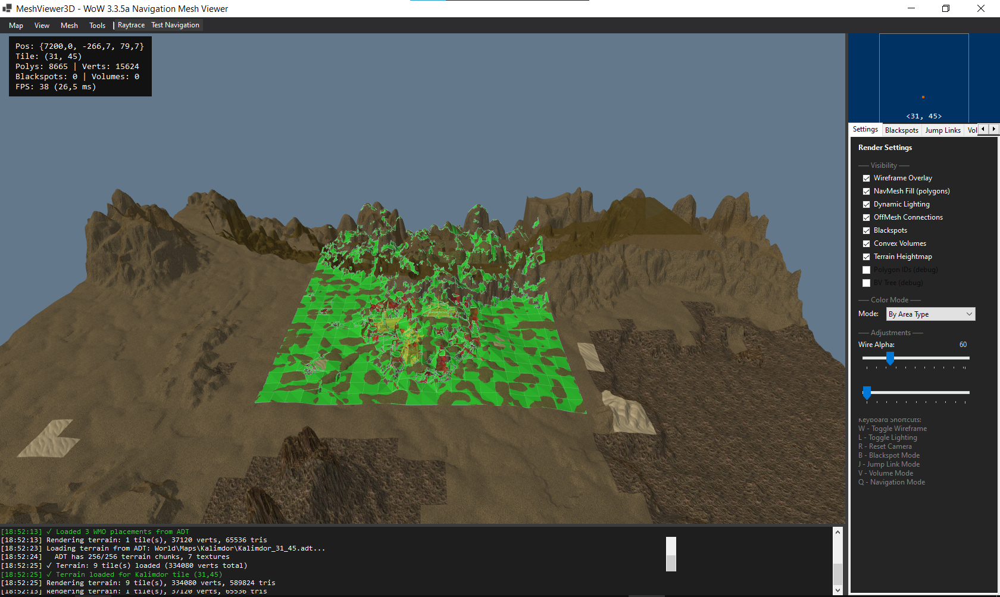

# MeshViewer3D

> NavMesh viewer and editor for WoW 3.3.5a (build 12340), inspired by Honorbuddy's Tripper.Renderer.




---

## Overview

MeshViewer3D loads Detour/Recast `.mmtile` navigation tiles and provides tools to:

### Rendering
- **NavMesh polygons** — area-type color coding (walkable/water/road/obstacle/…), wireframe, polygon fill, per-component coloring
- **OffMesh connections** — parabolic arc display with directional arrowhead and start-circle marker; cyan = bidirectional, orange = unidirectional
- **Tile seam borders** — thick dark-green edge lines at boundaries between loaded tiles, making multi-tile topology immediately readable
- **WMO buildings** — full 3D geometry from MPQ archives via ADT MODF placements
- **M2 doodads** — bounding geometry for placed models (same coordinate pipeline as WMO)
- **Terrain heightmap** — ADT MCNK chunks rendered as a UV-textured, height-correct ground mesh; center tile + optional 3×3 grid

### Navigation debug
- **Raytrace mode** — click anywhere to place a precision target reticle (ring + arms + stem); overlay shows WoW coords, tile, polygon index and area type
- **Test Navigation** — click to set A and B, runs A* + Funnel algorithm with off-mesh traversal, path rendered as dark dashed lines with Start/End screen labels
- **NavMesh Analysis** — BFS connected-component detection with distinct per-component colors (`A` key)

### Editing
- **Blackspots** — cylindrical no-go zones; click to place, drag to move, scroll to resize; Honorbuddy XML compatible
- **Jump Links** — two-click custom OffMesh connections; XML + binary `.offmesh` + CSV export
- **Convex Volumes** — click vertices, `Enter` to finalize; per-volume area type; XML save/load
- **Undo / Redo** — full command history for all edit operations (`Ctrl+Z` / `Ctrl+Y`)

### UI
- **Live overlay** — WoW coords, current tile (follows camera), polygon count, FPS, active mode
- **Minimap** — 64×64 tile grid; loaded tiles shown in green; camera position tracked in real time with a red dot and `<X, Y>` label
- **WMO Blacklist** — hide individual WMO models from the viewport
- **Per-Model Overrides** — per-model volume/collision settings, JSON Export/Import

All coordinate display is in WoW world space. Internal storage uses Detour coordinates.

---

## Requirements

| Requirement | Version |
|-------------|---------|
| OS | Windows 10/11 |
| Runtime | .NET 6.0 |
| GPU | OpenGL 3.3+ |

## Quick Start

```
cd MeshViewer3D
dotnet run
```

1. **Map > Load Tile** — single `.mmtile`  
   **Map > Load Folder** — loads all tiles in a folder (auto-subset near center if vertex limit reached)  
   **Map > Load Terrain from ADT** — loads ground heightmap for the selected area (center tile + 3×3 optional)
2. Optionally set **Map > Set WoW Data Folder** to enable WMO/M2/terrain rendering from MPQ archives
3. Orbit with middle mouse, pan with `Shift+MMB` or right mouse, zoom with scroll wheel
4. Click **Raytrace** in the toolbar to inspect any point on the mesh; click **Test Nav** to set A→B pathfinding points
5. Press **B / J / V** for edit modes; **Ctrl+S** to save

---

## Controls

### Camera

| Action | Input |
|--------|-------|
| Orbit | Middle mouse drag |
| Pan | `Shift+Middle` drag or Right mouse drag |
| Zoom | Scroll wheel or `Ctrl+Middle` drag |
| Frame scene | `R` or `Home` |
| View presets | Numpad `1` / `3` / `7` and `Ctrl` variants |
| Focus selection | `F` |
| Toggle free camera | `C` |
| Free camera move | `W` / `A` / `S` / `D` / `Q` / `E` |

The old left-drag camera orbit is no longer used. Camera navigation follows a Blender-style controller, and free camera movement uses `Q/E` for vertical motion while active.

### Editing

| Key | Action |
|-----|--------|
| `B` | Toggle blackspot placement mode |
| `J` | Toggle jump link placement mode (click start, then end) |
| `V` | Toggle convex volume placement mode (click vertices) |
| `Enter` | Finalize convex volume (in V mode) |
| `Escape` | Cancel current mode / deselect |
| `Q` | Return to navigation mode (disable all edit modes) |
| `Delete` | Delete selected element |
| `G` | Go to coordinates dialog |
| `F` | Focus current selection |
| `C` | Toggle free camera mode |
| `Ctrl+Z` | Undo |
| `Ctrl+Y` or `Ctrl+Shift+Z` | Redo |
| `Shift+Wheel` | Adjust blackspot radius |
| `Ctrl+Wheel` | Adjust blackspot height |

### File Shortcuts

| Key | Action |
|-----|--------|
| `Ctrl+O` | Load blackspots XML |
| `Ctrl+S` | Save blackspots XML |
| `Ctrl+N` | Clear all blackspots |

### View Toggles

| Key | Action |
|-----|--------|
| `W` | Toggle wireframe |
| `L` | Toggle lighting |
| `A` | Toggle NavMesh Analysis (connected-component coloring) |

### Debug Modes (toolbar buttons)

| Button | Action |
|--------|--------|
| **Raytrace** | Click mesh to inspect point — WoW coords, tile, polygon index, area type |
| **Test Nav** | Click to set start (A) then end (B) — runs A* + Funnel pathfinding |

---

## File Formats

### Blackspots (XML — Honorbuddy compatible)
```xml
<Blackspots>
  <Blackspot X="1234.56" Y="7890.12" Z="345.67"
             Radius="10.00" Height="20.00" Name="Zone" />
</Blackspots>
```

### Jump Links (XML)
```xml
<OffMeshConnections Version="1.0">
  <Connection StartX="..." StartY="..." StartZ="..."
              EndX="..." EndY="..." EndZ="..."
              Radius="1.00" Bidirectional="True" />
</OffMeshConnections>
```

### Convex Volumes (XML)
```xml
<ConvexVolumes Version="1.0">
  <Volume Name="Water Zone" AreaType="Water" MinHeight="0" MaxHeight="50">
    <Vertex X="1234.56" Y="5678.90" Z="100.00" />
    <Vertex X="1244.56" Y="5678.90" Z="100.00" />
    <Vertex X="1244.56" Y="5688.90" Z="100.00" />
  </Volume>
</ConvexVolumes>
```

All XML coordinates are in **WoW world space** (X=North, Y=West, Z=Up).

---


## Technologies

- **.NET 6.0-windows** — WinForms application
- **OpenTK 4.8.2** — OpenGL 3.3+ bindings
- **Newtonsoft.Json** — Map name lookup
- **Pure C# MPQ** — No native DLL dependencies for archive reading

---

## Coordinate System

| Space | Axes | Usage |
|-------|------|-------|
| **WoW** | X=North, Y=West, Z=Up | UI display, XML files |
| **Detour** | X=-WoW.Y, Y=WoW.Z, Z=-WoW.X | Internal storage, tile data |
| **OpenGL** | Same as Detour | Rendering |

Conversion: `CoordinateSystem.WowToDetour()` / `DetourToWow()`

---

## Reference

- [Recast/Detour](https://github.com/recastnavigation/recastnavigation) — Navigation mesh library
- [wowdev.wiki/ADT](https://wowdev.wiki/ADT/v18) — ADT v18 format documentation
- [wowdev.wiki/WMO](https://wowdev.wiki/WMO) — WMO v17 format documentation
- [DOCUMENTATION.md](DOCUMENTATION.md) — Full user guide
