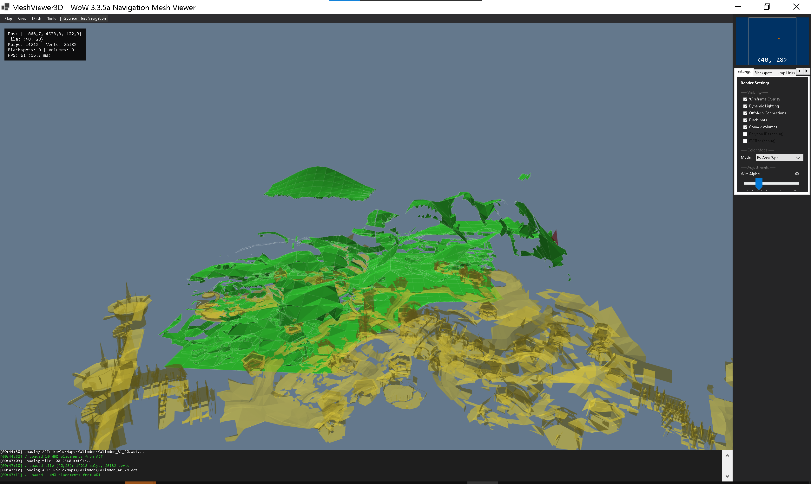

# MeshViewer3D

> NavMesh viewer and editor for WoW 3.3.5a (build 12340), inspired by Honorbuddy's Tripper.Renderer.




---

## Overview

MeshViewer3D loads Detour/Recast `.mmtile` navigation tiles and provides tools to:

- **View** navmesh polygons with area-type coloring, wireframe, and OffMesh connections
- **Edit blackspots** — cylindrical no-go zones (compatible with Honorbuddy XML format)
- **Create jump links** — custom OffMesh connections between two points (XML + binary `.offmesh`)
- **Define convex volumes** — polygonal areas with custom area types (XML)
- **Visualise WMO buildings** — loads WMO geometry from MPQ archives via ADT tile references

All coordinate display is in WoW world space. Internal storage uses Detour coordinates.

---

## Requirements

| Requirement | Version |
|-------------|---------|
| OS | Windows 10/11 |
| Runtime | .NET 6.0 |
| GPU | OpenGL 3.3+ |

## Quick Start

```
cd MeshViewer3D
dotnet run
```

1. **Map > Load Tile** or **Load Folder** — select `.mmtile` file(s)
2. Press **B** to enter blackspot placement, click on terrain
3. Press **J** to enter jump link mode, click start then end
4. Press **V** to enter volume mode, click vertices, press **Enter** to finalize
5. **Ctrl+S** to save

---

## Feature Status

| Feature | Status | Notes |
|---------|--------|-------|
| NavMesh rendering (area colors, wireframe) | **Done** | Multi-tile support with 60k vertex safety limit |
| OffMesh connection display (from tiles) | **Done** | Cyan = bidirectional, Orange = unidirectional |
| Blackspot editor | **Done** | Click to place, drag to move, scroll to resize, XML save/load |
| Jump Link editor | **Done** | Two-click placement, XML + `.offmesh` binary save/load, CSV export |
| Convex Volume editor | **Done** | Click vertices, Enter to finalize, XML save/load |
| WMO 3D visualization | **Done** | Pure C# MPQ reader, WMO v17 parser, ADT v18 MODF instances. Set Data folder via Map menu |
| Map directory lookup | **Done** | Dynamic Maps.json database (40 maps, all 3.3.5a), replaces hardcoded 5-map switch |
| WoW Data path persistence | **Done** | Auto-saved to settings.json, restored on startup with MPQ validation |
| Go To Coordinates | **Done** | G key, dialog input |
| Minimap (tile grid) | **Done** | Shows loaded tiles |
| Settings panel | **Done** | Toggle wireframe/lighting/offmesh/blackspots/volumes, color modes |
| Raytrace mode | **Done** | 3D cursor marker on navmesh, shows WoW coords + AreaType + poly index |
| Test Navigation (A→B pathfinding) | **Done** | A* + Funnel Algorithm, cross-tile, off-mesh traversal, smooth paths |
| NavMesh Analysis | **Done** | Connected components (BFS), degenerate polygon detection, component coloring (A key) |
| Export Paths | **Done** | JSON, CSV, HB Hotspot XML (Tools menu) |
| Undo/Redo | **Done** | Ctrl+Z / Ctrl+Y — blackspots, volumes, jump links (Command Pattern) |
| WMO Blacklist | **Done** | CheckedListBox, Select All/Deselect All, Export/Import |
| Per-Model Overrides | **Done** | Per-model volume/collision settings, JSON Export/Import |
| M2 model rendering | **Done** | Bounding geometry parser (0xD8 offsets), same coordinate pipeline as WMO |
| Terrain heightmap (ADT MCNK) | **Not started** | Ground mesh rendering not written |
| BLP texture loading | **Not started** | No GPU texture upload |
| WDT parser (world tile index) | **Not started** | Manual tile selection only |

---

## Controls

### Camera

| Action | Input |
|--------|-------|
| Orbit | Middle mouse drag or Left mouse drag |
| Pan | Right mouse drag |
| Zoom | Scroll wheel |
| Reset | `R` or `Home` |
| Focus selection | `F` |

### Editing

| Key | Action |
|-----|--------|
| `B` | Toggle blackspot placement mode |
| `J` | Toggle jump link placement mode (click start, then end) |
| `V` | Toggle convex volume placement mode (click vertices) |
| `Enter` | Finalize convex volume (in V mode) |
| `Escape` | Cancel current mode / deselect |
| `Q` | Return to navigation mode (disable all edit modes) |
| `Delete` | Delete selected element |
| `G` | Go to coordinates dialog |
| `Shift+Wheel` | Adjust blackspot radius |
| `Ctrl+Wheel` | Adjust blackspot height |

### File Shortcuts

| Key | Action |
|-----|--------|
| `Ctrl+O` | Load blackspots XML |
| `Ctrl+S` | Save blackspots XML |
| `Ctrl+N` | Clear all blackspots |
| `W` | Toggle wireframe |
| `L` | Toggle lighting |

---

## File Formats

### Blackspots (XML — Honorbuddy compatible)
```xml
<Blackspots>
  <Blackspot X="1234.56" Y="7890.12" Z="345.67"
             Radius="10.00" Height="20.00" Name="Zone" />
</Blackspots>
```

### Jump Links (XML)
```xml
<OffMeshConnections Version="1.0">
  <Connection StartX="..." StartY="..." StartZ="..."
              EndX="..." EndY="..." EndZ="..."
              Radius="1.00" Bidirectional="True" />
</OffMeshConnections>
```

### Convex Volumes (XML)
```xml
<ConvexVolumes Version="1.0">
  <Volume Name="Water Zone" AreaType="Water" MinHeight="0" MaxHeight="50">
    <Vertex X="1234.56" Y="5678.90" Z="100.00" />
    <Vertex X="1244.56" Y="5678.90" Z="100.00" />
    <Vertex X="1244.56" Y="5688.90" Z="100.00" />
  </Volume>
</ConvexVolumes>
```

All XML coordinates are in **WoW world space** (X=North, Y=West, Z=Up).

---

## Architecture

```
MeshViewer3D/
├── Core/
│   ├── MmtileLoader.cs          Trinity/Mangos .mmtile parser (Detour format)
│   ├── NavMeshData.cs            Vertex/poly container, Merge(), render data generation
│   ├── CoordinateSystem.cs       WoW ↔ Detour ↔ OpenGL conversions
│   ├── EditableElements.cs       Central store for blackspots, volumes, jump links
│   ├── MapDatabase.cs            Maps.json loader — GetDirectory/GetName/Get by mapId
│   ├── AppSettings.cs            Persistent settings (settings.json) — WoW Data path
│   ├── NavMeshPathfinder.cs      A* pathfinder on Detour polygon graph (Neis[] traversal)
│   ├── Mpq/
│   │   ├── MpqArchive.cs         Pure C# MPQ v1/v2 reader (crypto, block/hash tables)
│   │   ├── MpqStream.cs          Decompression (Deflate, Zlib, PKLib, Huffman, WAV)
│   │   ├── MpqFileSystem.cs      Priority-stack VFS over multiple archives
│   │   └── WowDataProvider.cs    High-level API: Open(dataPath) → GetFileBytes()
│   └── Formats/
│       ├── ChunkReader.cs        Shared IFF chunk walker for WoW binary files
│       ├── Wmo/
│       │   ├── WmoFile.cs        WMO v17 root parser (MOHD → GroupCount, bounds)
│       │   ├── WmoGroup.cs       WMO v17 group parser (MOVT/MOVI/MOPY → geometry)
│       │   └── WmoStructures.cs  MogiGroupFlags, MopyFlags enums
│       ├── Adt/
│       │   ├── AdtFile.cs        ADT v18 parser (MWMO/MWID/MODF, MMDX/MMID/MDDF)
│       │   └── AdtStructures.cs  MODF (64B) and MDDF (36B) structs
│       └── M2/
│           └── M2File.cs         M2 bounding geometry parser (WotLK header, offsets 0xD8-0xE4)
├── Data/
│   ├── Blackspot.cs              Cylindrical no-go zone struct
│   ├── BlackspotSerializer.cs    XML save/load + CSV export
│   ├── ConvexVolume.cs           Polygonal volume with AreaType
│   ├── ConvexVolumeSerializer.cs XML save/load (child Vertex elements)
│   ├── OffMeshConnection.cs      Custom jump link struct (36 bytes, matches Detour)
│   ├── OffMeshSerializer.cs      XML + binary (.offmesh) + CSV export
│   ├── AreaType.cs               MaNGOS NavTerrain area types + AreaTypeInfo catalog
│   ├── MeshHeader.cs             Detour dtMeshHeader mirror
│   └── NavPoly.cs                Detour polygon structs
├── Rendering/
│   ├── NavMeshRenderer.cs        Main OpenGL renderer (mesh, wireframe, offmesh, blackspots, volumes, WMO, M2)
│   ├── WmoRenderer.cs            Per-WMO-instance renderer (CPU-baked world transform, yellow)
│   ├── M2Renderer.cs             Per-M2-doodad renderer (bounding geometry, red)
│   ├── Camera.cs                 Orbit camera (orbit/pan/zoom)
│   ├── RayCaster.cs              Screen→world ray, Möller-Trumbore, cylinder intersection
│   ├── ShaderProgram.cs          GLSL shader compile/link
│   └── ColorScheme.cs            Area colors, height gradients, wireframe colors
├── UI/
│   ├── MainForm.cs               Main window, menus, keyboard routing, OpenGL host
│   ├── BlackspotPanel.cs         Blackspot list + property editor
│   ├── JumpLinksPanel.cs         Jump link list + two-click placement
│   ├── ConvexVolumesPanel.cs     Volume list + vertex placement + preview
│   ├── GameObjectPanel.cs        WMO/M2 file lists with visibility toggles
│   ├── WmoBlacklistPanel.cs      WMO blacklist with Select All/Deselect All, Export/Import
│   ├── PerModelPanel.cs          Per-model overrides (collision, area type, scale), JSON Export/Import
│   ├── SettingsPanel.cs          Rendering toggles, color modes, alpha/fog sliders
│   ├── MinimapControl.cs         2D tile grid (64×64)
│   └── ConsoleControl.cs         Color-coded log output
└── Resources/
    ├── mesh.vert / mesh.frag     Navmesh shader (position + color + lighting + alpha)
    ├── line.vert / line.frag     Uniform-color line shader
    ├── colored_line.vert/frag    Per-vertex color line shader
    └── Maps.json                 Map ID → name/directory lookup (40 maps, WoW 3.3.5a Map.dbc)
```

### Technologies

- **.NET 6.0-windows** — WinForms application
- **OpenTK 4.8.2** — OpenGL 3.3+ bindings
- **Newtonsoft.Json** — Map name lookup
- **Pure C# MPQ** — No native DLL dependencies for archive reading

---

## Build

```
dotnet build MeshViewer3D.csproj
```

Current status: **0 errors, ~70 warnings** (nullable annotations, pre-existing SDK warnings).

---

## Coordinate System

| Space | Axes | Usage |
|-------|------|-------|
| **WoW** | X=North, Y=West, Z=Up | UI display, XML files |
| **Detour** | X=-WoW.Y, Y=WoW.Z, Z=-WoW.X | Internal storage, tile data |
| **OpenGL** | Same as Detour | Rendering |

Conversion: `CoordinateSystem.WowToDetour()` / `DetourToWow()`

---

## Reference

- [Recast/Detour](https://github.com/recastnavigation/recastnavigation) — Navigation mesh library
- [wowdev.wiki/ADT](https://wowdev.wiki/ADT/v18) — ADT v18 format documentation
- [wowdev.wiki/WMO](https://wowdev.wiki/WMO) — WMO v17 format documentation
- [DOCUMENTATION.md](DOCUMENTATION.md) — Full user guide
